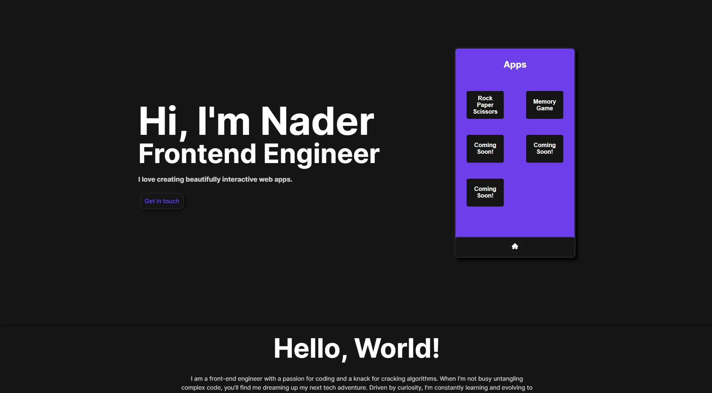

<p align="center">
  
</p>
<h1 align="center">
  nadocodes.netlify.app - v1
</h1>
<p align="center">
  <a href="" target="_blank">nadocodes.netlify.app</a> built with React.js leveraging TypeScript.
</p>



## 🛠 set-up

1. Install the dependencies

   ```sh
   npm install or yarn
   ```

2. Start the development server

   ```sh
   npm run dev
   ```

## 🚀 build and run for production

1. Generate a full static production build

   ```sh
   npm run build
   ```


## 🎨 color codes

| Color          | Hex                                                                |
| -------------- | ------------------------------------------------------------------ |
| Darkest Gray   |  `#161616` |
| Dark Gray      |  `#242424` |
| Purple         |  `#6C41EC` |
| Light Purple   |  `#845CF5` |
| White          |  `#FFFFFF` |
| Light Green    |  `#11f51c` |
| Dark Green     |  `#279242` |
| Light Orange   |  `#fc9c2f` |
| Dark Odange    |  `#fd6602` |